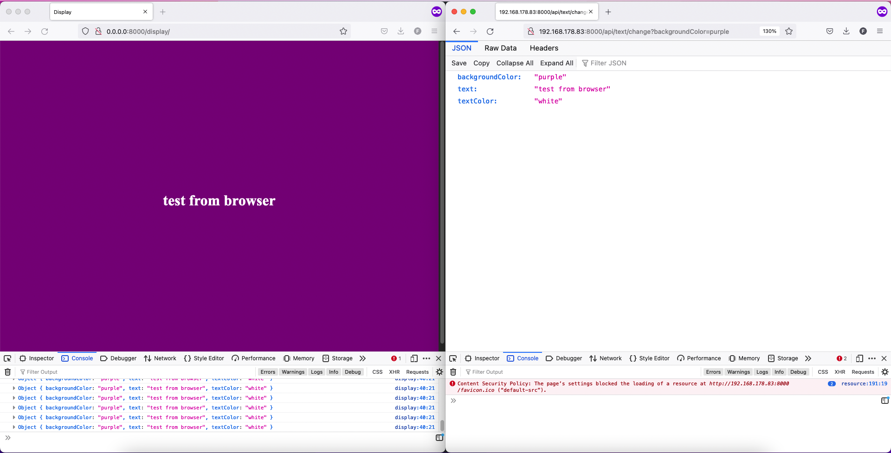

# REST-API-Demo

### [GET] /display
Die grafische Display-Seite, die den Text, die Textfarbe und die Hintergrundfarbe anzeigt, die über die API festgelegt werden können.




## [GET] /api/text/get
Gibt den Text, die Textfarbe und die Hintergrundfarbe im JSON-Format zurück.

Beispiel:
```json
{
    "text": "Hello world",
    "textColor": "white",
    "backgroundColor": "purple"
}
```

## [GET] /api/text/change
Gibt das Gleiche zurück wie `/api/text/get`.

### Params

`text` - Der neue Text, der auf der Display-Seite angezeigt werden soll.

`textColor` - Die neue Farbe, die der Text haben soll (HTML color code/englisches Wort kleingeschrieben)

`backgroundColor` - Die neue Farbe, die der Hintergrund haben soll (HTML color code/englisches Wort kleingeschrieben)

